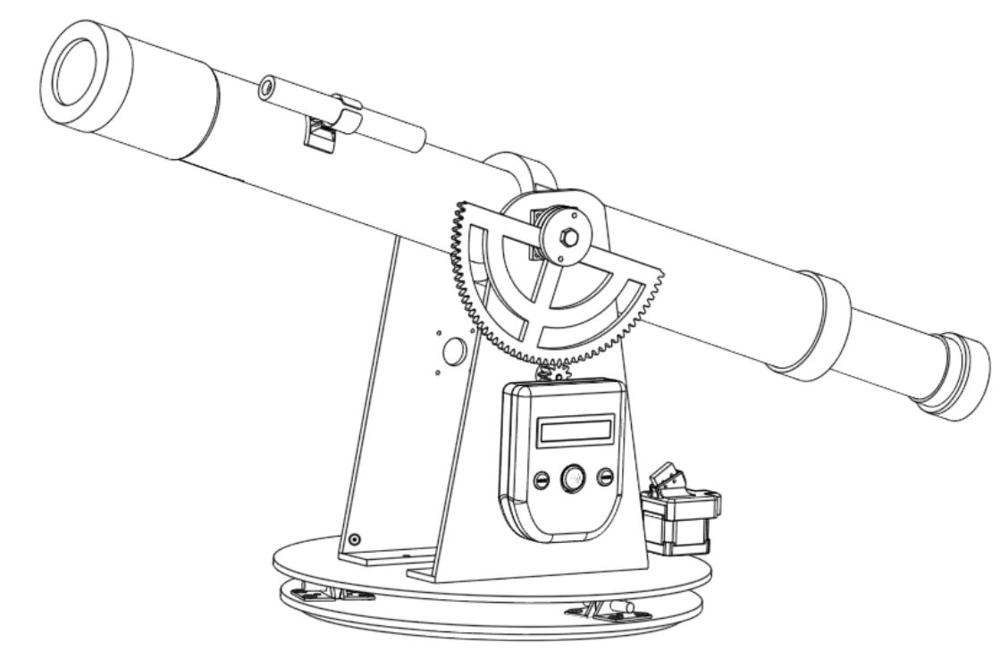
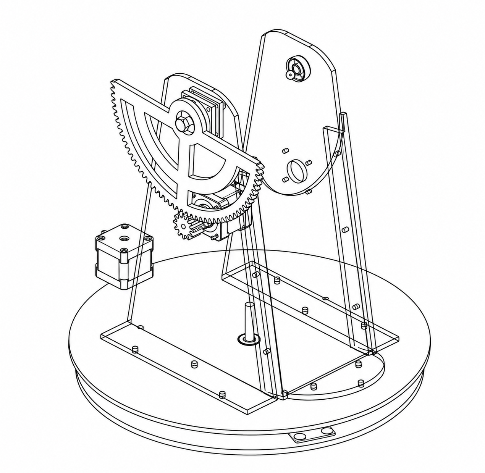

# Autoguided Dobsonian Telescope 🔭

## Overview
This repository contains the design, mathematical modeling, and hardware/software implementation of an **Autoguided Dobsonian Telescope**. The primary objective is to make astronomical observation more accessible by automating the aiming and tracking of celestial objects. 

This project was carried out by **AK-HAIL Oussama** as part of an engineering internship in partnership with **Orange Digital Center** and **Moussasoft**.

## Key Features
* **Custom 3D Printed & Laser-Cut Mechanics**: Designed entirely on Onshape.
* **Dual-Microcontroller Architecture**: Uses two Arduino Nano boards to isolate stepper motor control from the user interface and calculations, preventing electromagnetic interference (EMI).
* **Four Operating Modes**:
  1. **Offline Mode**: Implements spherical trigonometry equations directly on the Arduino to convert equatorial coordinates (RA, Dec) to horizontal coordinates (Alt, Az) on the fly for an embedded catalog of 20 stars.
  2. **Online Mode**: A Python/Tkinter desktop app that interfaces with Stellarium Web (via Selenium) to scrape coordinates and send them to the telescope via UART.
  3. **Tracking Mode**: Algorithm that continuously compensates for Earth's rotation by updating Alt/Az speeds in real-time.
  4. **Manual Mode**: Analog joystick control for manual point-and-shoot.

## Hardware Architecture

### Mechanical Design
The telescope uses a Dobsonian (Alt-Azimuth) mount, chosen for its stability and low cost.

* **Azimuth Base**: Driven by a GT2 timing belt acting as a ring gear, mounted on laser-cut plexiglass with a 35.7:1 reduction ratio.

* **Altitude Axis**: Uses a 3D-printed half-gear mechanism with an 8.7:1 reduction ratio.

* **Telescopic Body**: Concentric PVC tubes with 3D-printed translation mechanisms for manual focusing.

*(General view of the assembled telescope)*

### Electronic Design
To ensure stability and isolate noise, the electronics are separated into two main circuits communicating via UART through an **ISO7221** digital isolator.

#### 1. Motor Control Circuit (Arduino #2)
Dedicated to power management and movement. It drives two NEMA 17 stepper motors via A4988 drivers with 1/32 microstepping for high precision and smooth movement.

#### 2. Remote Control Circuit (Arduino #1)
Acts as the brain of the system. It handles the UI (16x2 I2C LCD, joystick, buttons) and the intensive spherical trigonometry calculations.

*(3D printed remote control enclosure)*

## Software Architecture

### Embedded System (C++)
The Arduino firmware implements:
- **Spherical Trigonometry**: Calculates Local Sidereal Time (LST) and Hour Angle (HA) to deduce Altitude and Azimuth.
- **Motor Control**: Converts Alt/Az angles into precise stepper motor pulses using the `AccelStepper` library.
- **Following Algorithm**: Calculates the instantaneous angular velocities required for both axes to track celestial objects as the Earth rotates.

### PC Interface (Python)
The `software.py` script provides a GUI to control the telescope online:
- Connects to the Arduino via Serial.
- Uses **Selenium** to automatically search for objects on Stellarium Web and extracts real-time Alt/Az coordinates.

*(Python Tkinter GUI for Online Mode)*

## Project Structure
* `CADs/`: 3D models and Onshape exports.
* `codes/`: Source code for the dual Arduino setup (`arduino1.cpp`, `arduino2.cpp`) and the Python control script (`software.py`).
* `photos/`: Images, CAD screenshots, and diagrams of the assembly and software.
* `circuits.pdf`: Detailed schematics of the electronic circuits.
* `main.tex`: LaTeX source of the internship report detailing the theoretical and practical aspects.

## Acknowledgments
* **Mohammed Bsiss** (Supervisor)
* **Orange Digital Center Agadir** (FabLab resources & tools)
* **Moussasoft** (Electronic components and expertise)

## License
Feel free to explore the code, modify it, and build your own versions of the telescope!
