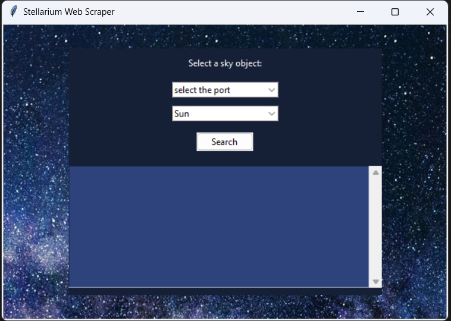

<h1 align="center">
  <br>
  <a href="https://github.com/OussamaAKHAIL/AK-SCOPE"></a>
  <br>
  <b>AK-SCOPE</b>
  <br>
</h1>

<h1 align="center">
 <a href="https://github.com/OussamaAKHAIL/AK-SCOPE/stargazers">
        
 </a>
 <a href="https://github.com/OussamaAKHAIL/AK-SCOPE/network/members">
        
 </a>
 <a href="https://www.arduino.cc/">
        
 </a>
 <a href="https://www.python.org/">
        
 </a>
</h1>

# General information

**AK-SCOPE** is a custom-built, fully open-source **Autoguided Dobsonian Telescope**. It combines 3D-printed mechanics, dual Arduino microcontrollers, and a Python-based interface to automatically aim and track celestial objects using spherical trigonometry.

<div align="center">
  
</div>

<br>

> [!IMPORTANT]
> This repository contains the complete software stack (embedded C++ and Python GUI), Onshape 3D models, electronic schematics, and the theoretical research report backing the project.

If you want to understand the theoretical foundation, check the included `main.tex` and the LaTeX report.

# Status

> [!IMPORTANT]
> AK-SCOPE is a functional prototype. It successfully implements offline tracking (using a predefined star catalog), online tracking (via Stellarium), and manual joystick control.

| Mechanical Design (Onshape CAD) | Assembled Telescope |
| :---: | :---: |
|  |  |

| Remote Control GUI (Python) | 3D Printed Remote Enclosure |
| :---: | :---: |
|  |  |

# Features and Operating Modes

The system operates across four primary modes:
1. **Offline Mode**: Uses embedded spherical trigonometry to convert RA/Dec to Alt/Az for 20 predefined stars directly on the Arduino.
2. **Online Mode**: Uses a Python Tkinter app to scrape Stellarium Web via Selenium and sends coordinates to the telescope.
3. **Tracking Mode**: Continuously compensates for the Earth's rotation to keep the object centered.
4. **Manual Mode**: Allows point-and-shoot using an analog joystick.

# Hardware Architecture

The electronics are intentionally separated to prevent electromagnetic interference (EMI) from the stepper motor drivers.

<div align="center">

| Component | Description |
|-----------|-------------|
| **Arduino #1 (Remote)** | Handles UI (LCD, Joystick, Buttons) and intensive math calculations. |
| **Arduino #2 (Motors)** | Receives commands via UART and drives two NEMA 17 steppers via A4988. |
| **ISO7221** | Digital isolator separating the communication of the two circuits. |
| **Mechanics** | GT2 timing belts, laser-cut plexiglass, and 3D printed PLA. |

</div>

# Usage examples

To run the PC Interface (Online Mode), simply run the Python script:

```sh
python codes/software.py
```
*Select your COM port from the dropdown, pick a celestial object, and hit Search.*

# Firmware and Code

All C++ firmware code must be uploaded to the respective Arduino boards:
- `codes/arduino1.cpp` -> Upload to the Remote Control Arduino.
- `codes/arduino2.cpp` -> Upload to the Motor Control Arduino.

# Main team

- **AK-HAIL Oussama** - *Creator & Lead Developer*

# Special Thanks

This project was carried out as part of an engineering internship. A huge thanks to:
- **Mohammed Bsiss** (Supervisor)
- [**Orange Digital Center Agadir**](https://www.orangedigitalcenters.com/) for providing FabLab resources (3D printers, laser cutters, oscilloscopes).
- [**Moussasoft**](https://www.moussasoft.com/) for supplying electronic components and expertise.

# License

Feel free to explore the code, modify it, and build your own versions of the telescope!
