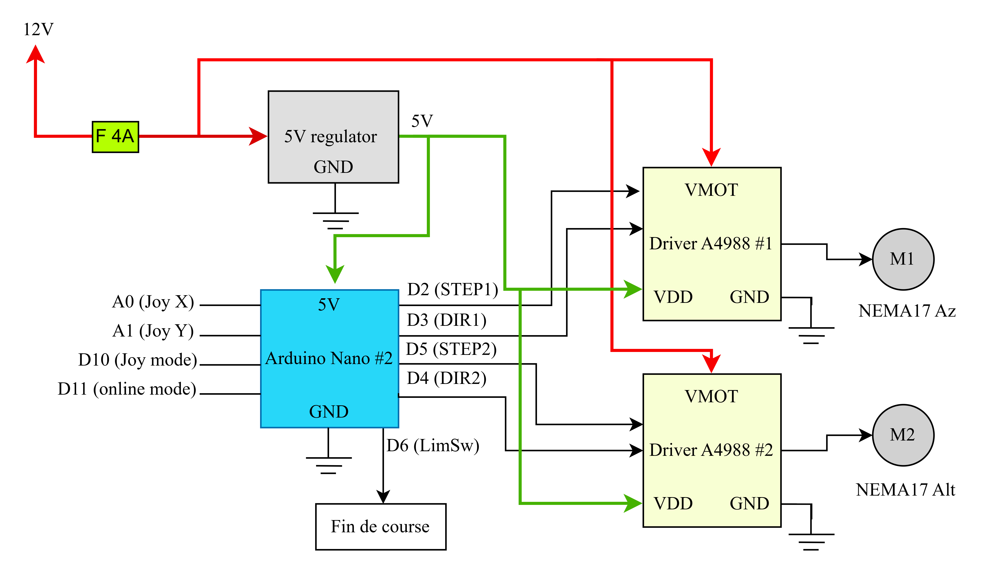

<h1 align="center">
  <br>
  <a href="https://github.com/OussamaAKHAIL/AK-SCOPE"></a>
  <br>
  <b>AK-SCOPE</b>
  <br>
</h1>

<h1 align="center">
 <a href="https://github.com/OussamaAKHAIL/AK-SCOPE/stargazers">
        
 </a>
 <a href="https://github.com/OussamaAKHAIL/AK-SCOPE/network/members">
        
 </a>
 <a href="https://www.arduino.cc/">
        
 </a>
 <a href="https://www.python.org/">
        
 </a>
</h1>

# General information

**AK-SCOPE** is a custom-built, fully open-source **Autoguided Dobsonian Telescope**. It combines 3D-printed mechanics, dual Arduino microcontrollers, and a Python-based interface to automatically aim and track celestial objects using spherical trigonometry. The goal of this project is to democratize astronomy by providing an affordable, DIY GoTo system for amateur astronomers.

<div align="center">
  
</div>

<br>

> [!IMPORTANT]
> This repository contains the complete software stack (embedded C++ and Python GUI), Onshape 3D models, electronic schematics, and the theoretical research report backing the project.

If you want to understand the theoretical foundation in full detail, check the included `main.tex` and the LaTeX report.

# Status

> [!IMPORTANT]
> AK-SCOPE is a fully functional prototype. It successfully implements offline tracking (using a predefined star catalog), online tracking (via Stellarium), and manual joystick control.

| Mechanical Design (Onshape CAD) | Assembled Telescope |
| :---: | :---: |
|  |  |

| Remote Control GUI (Python) | 3D Printed Remote Enclosure |
| :---: | :---: |
|  |  |

# Mathematical Foundation

At the core of AK-SCOPE is a rigorous implementation of spherical trigonometry to convert absolute equatorial coordinates (Right Ascension `RA`, Declination `Dec`) into local horizontal coordinates (Altitude `Alt`, Azimuth `Az`).

1. **Local Sidereal Time (LST)**: Calculated using the system's real-time clock (RTC) and geographical longitude.
2. **Hour Angle (HA)**: Defines the object's position relative to the local meridian: 
   `HA = (LST - RA) × 15`
3. **Altitude & Azimuth**: Using the spherical law of cosines on the `PZS` (Pole-Zenith-Star) triangle:
   - `sin(Alt) = sin(Dec)sin(Lat) + cos(Dec)cos(Lat)cos(HA)`
   - `cos(Az) = (sin(Dec) - sin(Alt)sin(Lat)) / (cos(Alt)cos(Lat))`

By computing these equations on the fly, the telescope can automatically point to any coordinate in the sky.

# Features and Operating Modes

The system operates across four primary modes, orchestrated by the master Arduino controller:

1. **Offline Mode**: Operates entirely without a PC. The firmware includes an embedded catalog of 20 bright stars (Sirius, Vega, Betelgeuse, etc.). The Arduino performs the floating-point trigonometry to locate the selected star.
2. **Online Mode**: Integrates with a PC via a custom Tkinter Python app. The app runs a headless **Selenium WebDriver** to scrape real-time coordinates from Stellarium Web and streams them via UART (115200 baud) to the telescope.
3. **Tracking Mode (Following Algorithm)**: As the Earth rotates, the target shifts. The firmware calculates the instantaneous angular velocity for both axes (`d(Alt)/dt` and `d(Az)/dt`) by deriving the spherical equations with respect to time, allowing the motors to continuously track the object for long-exposure astrophotography.
4. **Manual Mode**: An analog joystick allows raw manual control, translating analog inputs to variable stepping speeds for framing adjustments.

# Hardware Architecture

The electronics are intentionally separated into a **Dual-Arduino Architecture** to prevent electromagnetic interference (EMI) from the stepper motor drivers from corrupting the sensitive I2C LCD and analog joystick signals.

<div align="center">

| Component | Description |
|-----------|-------------|
| **Arduino #1 (Remote)** | Acts as the brain. Handles UI (LCD, Joystick, Buttons) and intensive math calculations. |
| **Arduino #2 (Motors)** | Dedicated power controller. Receives commands via UART and drives two NEMA 17 steppers via A4988. |
| **ISO7221** | Digital isolator separating the communication lines of the two circuits, ensuring galvanic isolation. |

</div>

### Bill of Materials (BOM) & Mechanics

The physical structure is based on a Dobsonian (Alt-Azimuth) mount, chosen for its extreme stability and low center of gravity.
- **Azimuth Base**: Driven by a GT2 timing belt acting as a 393-tooth ring gear, interacting with an 11-tooth pinion (Reduction ratio: `35.7:1`).
- **Altitude Axis**: Uses a 3D-printed 96-tooth half-gear mechanism (Reduction ratio: `8.7:1`).
- **Motors**: NEMA 17 stepper motors (1.8°/step) driven by A4988 drivers operating in **1/32 microstepping** mode. This provides an extraordinary theoretical angular resolution of up to `5.7 arcseconds` in azimuth!
- **Body**: Concentric PVC tubes (63mm / 50mm) sliding on 3D-printed translation rails for manual focusing.
- **Optics**: 1000mm focal length primary objective lens and 83mm focal length eyepiece, yielding a ~12x magnification with a wide field of view.

<div align="center">
  
  
</div>
*Left: Motor Control Circuit (Arduino #2). Right: Remote Control Circuit (Arduino #1).*

# Usage examples

To run the PC Interface (Online Mode), simply run the Python script:

```sh
python codes/software.py
```
*Select your COM port from the dropdown, pick a celestial object from the database, and hit Search to launch the automated tracking sequence.*

# Firmware and Code

All C++ firmware code must be uploaded to the respective Arduino boards:
- `codes/arduino1.cpp` -> Upload to the **Remote Control** Arduino.
- `codes/arduino2.cpp` -> Upload to the **Motor Control** Arduino.

# Main team

- **AK-HAIL Oussama** - *Creator & Lead Developer*

# Special Thanks

This project was carried out as part of an engineering internship. A huge thanks to:
- **Mohammed Bsiss** (Supervisor)
- [**Orange Digital Center Agadir**](https://www.orangedigitalcenters.com/) for providing FabLab resources (3D printers, laser cutters, oscilloscopes).
- [**Moussasoft**](https://www.moussasoft.com/) for supplying electronic components, stepper motors, and invaluable integration expertise.

# License

This project is licensed under the [**MIT License**](LICENSE). Feel free to explore the code, modify it, and build your own versions of the telescope!
